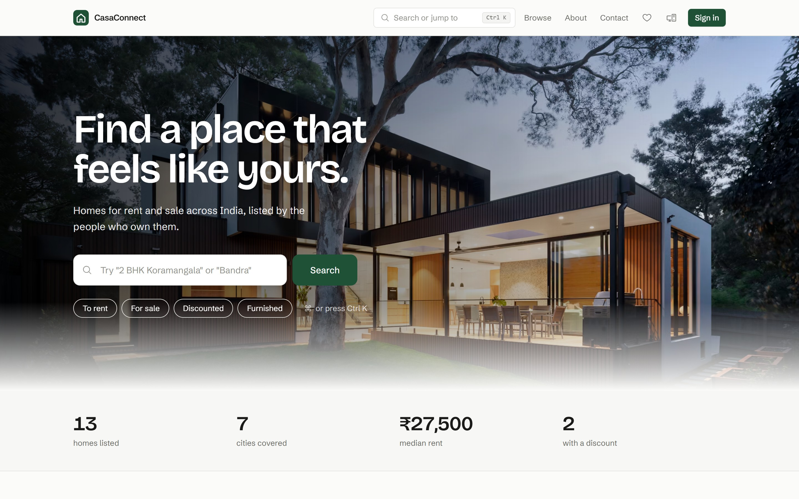
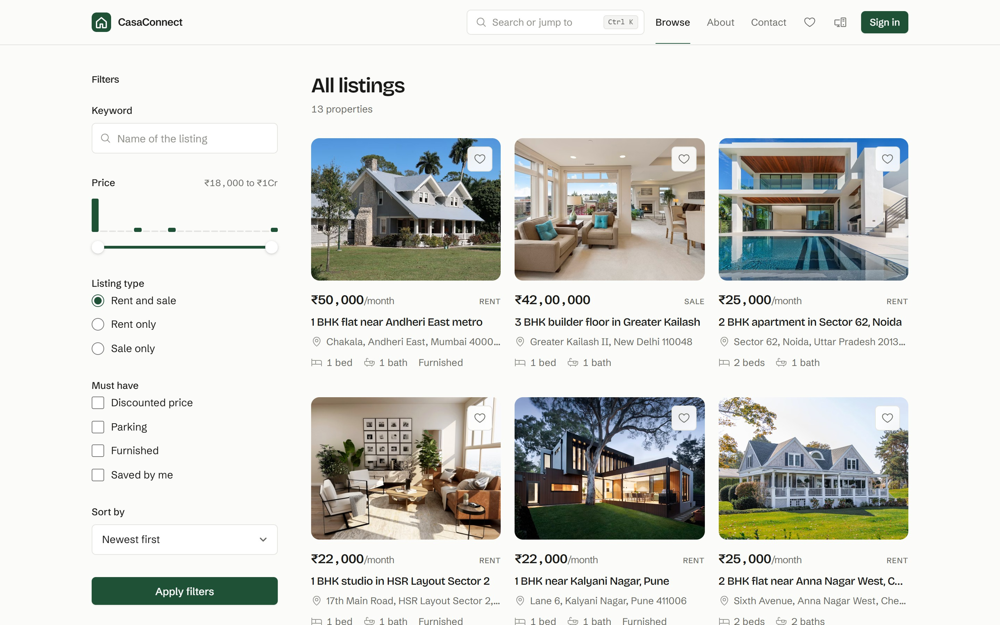
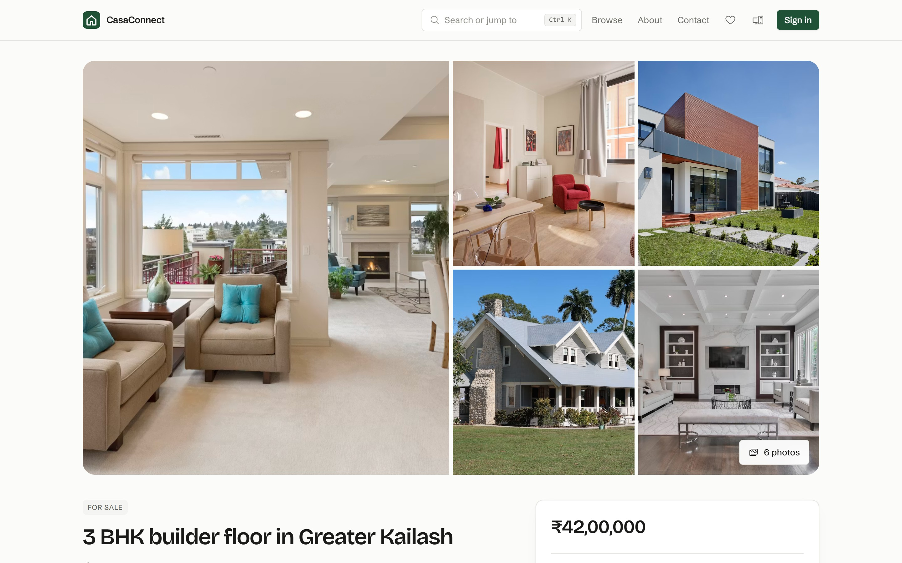
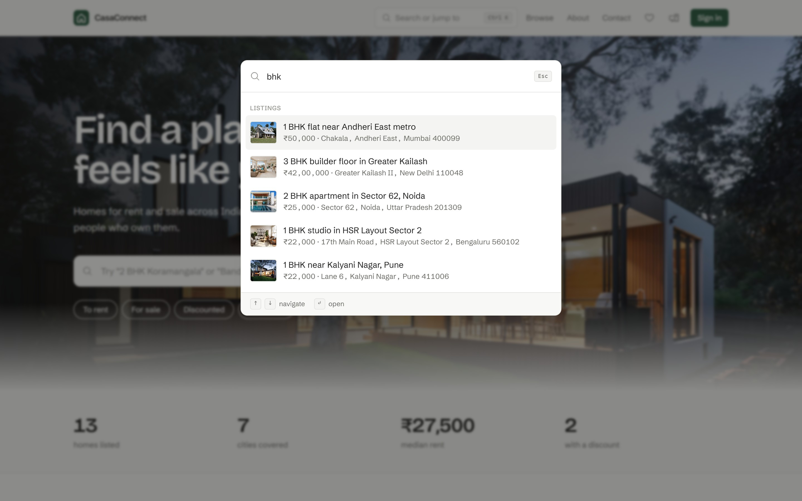
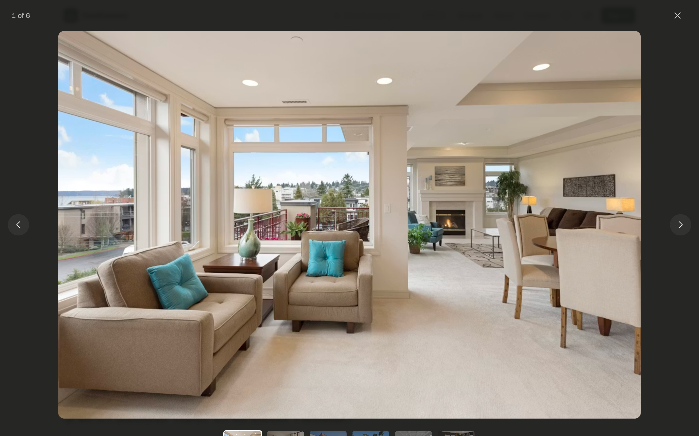
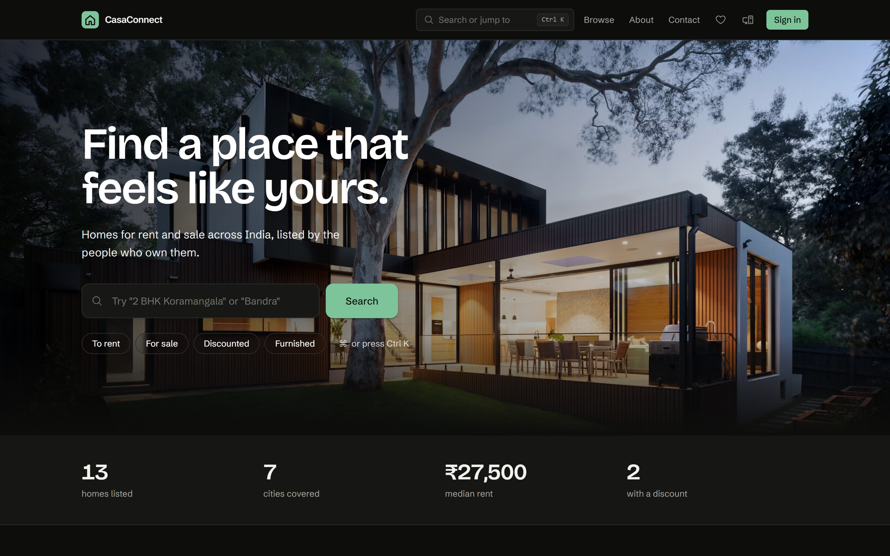
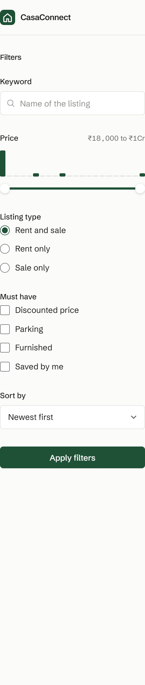
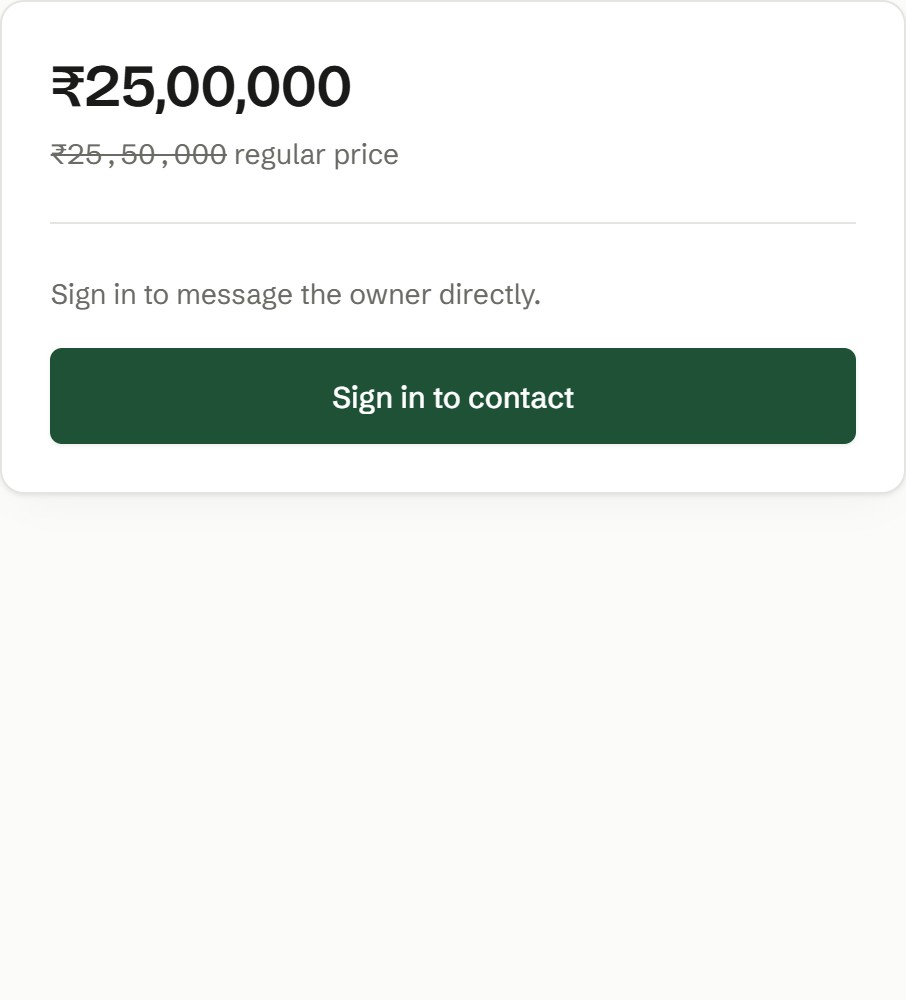

# CasaConnect

A property marketplace where owners publish homes for rent or sale and people
looking for a place contact them directly. Built on the MERN stack as a major
academic project.

There are no brokers, no verification team and no commission. Every listing and
account is a real record in the application's own database, created by someone
using the site.



---

## Contents

1. [Overview](#1-overview)
2. [Screens](#2-screens)
3. [Feature reference](#3-feature-reference)
4. [Architecture](#4-architecture)
5. [Tech stack](#5-tech-stack)
6. [Getting started](#6-getting-started)
7. [Environment variables](#7-environment-variables)
8. [API reference](#8-api-reference)
9. [Data models](#9-data-models)
10. [Authentication](#10-authentication)
11. [Frontend architecture](#11-frontend-architecture)
12. [Design system](#12-design-system)
13. [Integrations](#13-integrations)
14. [Maintenance scripts](#14-maintenance-scripts)
15. [Deployment](#15-deployment)
16. [Known issues and limitations](#16-known-issues-and-limitations)
17. [Troubleshooting](#17-troubleshooting)

---

## 1. Overview

### What it is

CasaConnect is a two-sided property marketplace. Owners publish a listing with
photographs, a price, room counts and amenities. People looking for a home
browse and filter those listings, then contact the owner directly by email or
WhatsApp. The application never sits in the middle of that conversation.

### What it is not

It is not a working estate agency. There are no employed agents, no listing
verification, no payments and no contracts. Nothing on the site is a commercial
claim.

### Who it is for

The primary audience is people searching for a home, so browsing, filtering and
the listing detail page carry the most design investment. Owner tools are a
complete second surface rather than an afterthought.

### Core concepts

| Term | Meaning |
| --- | --- |
| **Listing** | One property, owned by exactly one user. Carries up to six images, a type, prices, rooms and amenity flags. |
| **Type** | Either `rent` or `sale`. Rentals price per month, sales price outright. |
| **Offer** | A flag on a listing. When set, `discountPrice` becomes the price actually shown, and the saving is badged. |
| **Saved** | A shortlist held in the visitor's browser. Not attached to an account and not synced across devices. |
| **Lead** | A Salesforce record written when a user signs up, updates their profile, or creates, updates or deletes a listing. |

---

## 2. Screens

36 desktop captures at 1440 x 900 and 2x pixel density live in
[`client/public/screenshots`](client/public/screenshots), broken out section by
section so individual pieces can be lifted for a report. The running
application serves a browsable gallery with per-image download links at
`/showcase`.

### Search and filtering

Sticky filter rail with a dual-handle price slider over a histogram of the
current result distribution. Every filter is mirrored into the URL, so a search
can be bookmarked or shared.



### Listing detail

Mosaic gallery, specification grid, and a price panel that stays in view while
the description scrolls.



### Command palette

`Ctrl` or `Cmd` + `K` from anywhere. Filters local navigation actions and
searches listings live behind a 220 ms debounce, with in-flight requests
aborted so a stale response can never overwrite a newer one.



### Gallery lightbox

Keyboard-driven photo viewer with arrow navigation, a thumbnail strip, and
focus returned to its trigger on close.



### Dark theme

Light, dark and system themes. Only CSS custom property values change between
them, so no duplicated dark-mode markup exists anywhere in the codebase.



### Component detail

| Statistics band | Filter rail | Price panel |
| --- | --- | --- |
|  |  |  |

Empty and error cases are captured too, including
[no search results](client/public/screenshots/search-05-empty-state.jpg) and the
[404 page](client/public/screenshots/misc-01-not-found.jpg).

---

## 3. Feature reference

### Browsing and search

- **Keyword search** matches listing names, case-insensitively, via a Mongo regex.
  Addresses and descriptions are not searched.
- **Type filter**: rent only, sale only, or both.
- **Amenity filters**: discounted price, parking, furnished. Each is a checkbox
  that narrows results; leaving one off matches both states rather than excluding.
- **Price range**: a dual-handle slider bounded by the cheapest and dearest
  result currently in scope, drawn over a 22-bucket histogram of that
  distribution. Applied in the browser so dragging is instant.
- **Sorting**: newest, oldest, price ascending, price descending.
- **URL state**: every filter except the price range is written into the query
  string, so a search is shareable and survives a refresh.
- **Pagination**: nine results per page, extended by a "Show more" button that
  reports exactly how many more it will add.

### Listing detail

- Mosaic gallery: a lead photograph beside a four-tile grid, with a photo count
  that opens the full viewer.
- Lightbox: arrow-key and on-screen navigation, a thumbnail strip, a position
  counter, `Escape` to close, and focus returned to the trigger.
- Specification grid: bedrooms, bathrooms, parking and furnishing.
- Sticky price panel showing the active price, the struck-through regular price
  when an offer applies, and the correct call to action for who is looking:
  sign in, contact the owner, or edit if it is your own listing.
- Share button copying the canonical URL to the clipboard with inline confirmation.

### Saved listings

- A heart on every card and on the detail page.
- Count badge in the header, updating immediately across the whole tree.
- `?saved=true` filters the search page down to the shortlist.
- Stored in `localStorage` under `casaconnect:saved`, synchronised between
  browser tabs through the `storage` event.

### Command palette

- Opens with `Ctrl` or `Cmd` + `K`, or the header trigger.
- Navigation actions: home, browse, rent, sale, saved, list a property, account,
  about, and the three theme modes.
- Live listing search with thumbnail, price and address per result.
- Arrow keys move, `Enter` opens, `Escape` closes, and the active row is kept
  scrolled into view.
- `Enter` with no match falls through to a full search for the typed text.

### Publishing and managing listings

- Create and edit run through one shared form component.
- Photographs by file upload or by pasting an image URL, up to six, with the
  first marked as the cover.
- Type as a radio group, amenities as checkboxes, room counts and prices as
  numeric fields with sensible bounds.
- Validation before submit: at least one image, and a discount lower than the
  regular price.
- Ownership is enforced on the server; the API rejects edits and deletes on
  listings you do not own.

### Account

- Email and password registration, or Google sign-in.
- Editable username, email, password, avatar and phone number.
- Portfolio summary: listing count, combined monthly rent, combined sale value,
  discounted count, and a bar chart of asking price per listing.
- Account deletion behind a confirmation prompt.

### Across the application

- Light, dark and system themes, persisted and synchronised across tabs.
- Skeleton loaders shaped like the content they replace.
- Composed empty states and inline error states on every data-backed view.
- Labels above inputs, visible focus rings, a skip link, semantic landmarks and
  descriptive alt text.
- `prefers-reduced-motion` honoured globally, including the animated background.

---

## 4. Architecture

```
Browser
  |
  |  React SPA (Vite dev server on :5173, or static files from Express)
  |
  |--- /api/*  ------------------------------------------.
  |    proxied in development, same origin in production  |
  |                                                       v
  |                                            Express app (:3000)
  |                                                       |
  |                                    .------------------+------------------.
  |                                    |                  |                  |
  |                                 Mongoose          jsforce           Nodemailer
  |                                    |                  |                  |
  |                                 MongoDB          Salesforce         SMTP relay
  |
  '--- Firebase Auth (Google sign-in popup, browser to Google directly)
```

### Request flow

1. The client calls a relative path such as `/api/listing/get`.
2. In development, Vite proxies `/api` to `http://localhost:3000`
   ([`client/vite.config.js`](client/vite.config.js)). In production, Express
   serves the built client and the API from the same origin, so no proxy exists.
3. Express matches the router mounted in [`api/index.js`](api/index.js).
4. Protected routes pass through `verifyToken`, which reads the `access_token`
   cookie, verifies the JWT and loads the user from MongoDB.
5. The controller runs, optionally writing a Salesforce lead and sending mail.
6. Errors are thrown to the shared error middleware, which returns
   `{ success: false, statusCode, message }`.

### Server startup order

`api/index.js` calls `app.listen()` **before** registering routers and static
middleware. Express allows this because routing is resolved per request rather
than at bind time, but it means the process accepts connections for a brief
window before MongoDB has connected. Requests arriving in that window fail.

---

## 5. Tech stack

| Layer | Technology |
| --- | --- |
| Build | Vite 4 with the SWC React plugin |
| Interface | React 18, React Router 6 |
| Styling | Tailwind CSS 3 with CSS custom properties for theming |
| State | Redux Toolkit with redux-persist (localStorage) |
| Motion | Motion (`motion/react`) |
| Icons | react-icons, Phosphor set (`react-icons/pi`) |
| Type | Bricolage Grotesque and Schibsted Grotesk, self-hosted via Fontsource |
| Dialogs | Radix UI Alert Dialog |
| Server | Node.js, Express 4 |
| Auth | jsonwebtoken, bcryptjs, Firebase Authentication |
| Data | MongoDB with Mongoose 7 |
| CRM | Salesforce via jsforce |
| Mail | Nodemailer |
| Scheduling | node-cron |

---

## 6. Getting started

### Prerequisites

- Node.js 18 or newer
- A MongoDB instance, local or Atlas
- Optionally a Firebase project for Google sign-in

### Install and run

Two terminals. The API and the client are separate npm packages.

```bash
# terminal 1, repository root
npm install
npm run dev            # nodemon, API on http://localhost:3000
```

```bash
# terminal 2
cd client
npm install
npm run dev            # Vite, UI on http://localhost:5173
```

Open <http://localhost:5173>. Vite proxies `/api` to port 3000, so use the 5173
URL rather than hitting the API directly in a browser.

Wait for `Server is running on port 3000!` and `Connected to MongoDB!` before
loading the page. Starting the client first produces `ECONNREFUSED` proxy
errors until the API is up.

### Production build

```bash
npm run build          # installs both packages, builds the client
npm start              # Express serves client/dist on port 3000
```

In this mode everything is on one origin at <http://localhost:3000> and there is
no Vite proxy.

### Available scripts

| Location | Script | Purpose |
| --- | --- | --- |
| root | `npm run dev` | API under nodemon with reload on change |
| root | `npm start` | API once, no watcher |
| root | `npm run build` | Install both packages and build the client |
| client | `npm run dev` | Vite dev server with hot module replacement |
| client | `npm run build` | Production build into `client/dist` |
| client | `npm run preview` | Serve the built output locally |
| client | `npm run lint` | ESLint over `src` |

---

## 7. Environment variables

### Root `.env`

```
MONGO=mongodb://localhost:27017/casaconnect
JWT_SECRET=any-long-random-string
```

### `client/.env`

```
VITE_FIREBASE_API_KEY=your-firebase-web-api-key
```

### Full reference

| Variable | File | Required | Purpose |
| --- | --- | --- | --- |
| `MONGO` | root | Yes | MongoDB connection string |
| `JWT_SECRET` | root | Yes | Signs and verifies the `access_token` cookie |
| `VITE_FIREBASE_API_KEY` | `client` | For Google sign-in | Firebase web API key |
| `EMAIL_SERVICE` | root | No | Nodemailer transport, defaults to `gmail` |
| `EMAIL_USER` | root | No | Sending address |
| `EMAIL_PASS` | root | No | App password for that address |
| `SALESFORCE_LOGIN_URL` | root | No | Salesforce login endpoint |
| `SALESFORCE_CLIENT_ID` | root | No | Connected app consumer key |
| `SALESFORCE_CLIENT_SECRET` | root | No | Connected app consumer secret |
| `SALESFORCE_USERNAME` | root | No | Integration user |
| `SALESFORCE_PASSWORD` | root | No | Integration user password |
| `SALESFORCE_SECURITY_TOKEN` | root | No | Appended to the password on login |

Only `VITE_`-prefixed variables are exposed to browser code, and Vite reads them
from `client/.env` alone. Putting a `VITE_` variable in the root `.env` has no
effect.

> **Important:** leaving the Salesforce variables unset currently breaks
> registration. See [Known issues](#16-known-issues-and-limitations).

---

## 8. API reference

All routes are mounted under `/api`. Errors return
`{ success: false, statusCode, message }`.

Authentication column:

- **Public** requires nothing.
- **Cookie** requires the `access_token` cookie set at sign-in.
- **Bearer** requires an `Authorization: Bearer <token>` header holding either an
  application JWT or a Firebase ID token.

### Auth, `/api/auth`

| Method | Path | Auth | Purpose |
| --- | --- | --- | --- |
| POST | `/signup` | Public | Register with email and password |
| POST | `/signin` | Public | Sign in, sets the cookie |
| POST | `/google` | Public | Sign in or register from a Google profile |
| GET | `/signout` | Public | Clear the cookie |

**POST `/api/auth/signup`**

```json
{ "username": "asha", "email": "asha@example.com", "password": "secret123", "phone": "9876543210" }
```

`phone` is optional. On success responds `201` with the string
`"User created successfully!"`. The password is hashed with bcrypt at 10 rounds
before storage.

**POST `/api/auth/signin`**

```json
{ "email": "asha@example.com", "password": "secret123" }
```

Responds `200` with the user document minus `password`, and sets an `httpOnly`
cookie named `access_token`. Returns `404` if the email is unknown and `401` if
the password is wrong.

**POST `/api/auth/google`**

```json
{ "name": "Asha Menon", "email": "asha@example.com", "photo": "https://..." }
```

If the email already exists, signs that user in. Otherwise creates an account
with a random password and a username derived from the display name plus four
random characters. Responds `200` with the user and sets the cookie.

### User, `/api/user`

| Method | Path | Auth | Purpose |
| --- | --- | --- | --- |
| GET | `/test` | Public | Health check, returns `{ message }` |
| POST | `/update/:id` | Cookie | Update your own account |
| DELETE | `/delete/:id` | Cookie | Delete your own account |
| GET | `/listings/:id` | Cookie | List your own listings |
| GET | `/:id` | Cookie | Fetch one user, password stripped |

`update` and `delete` compare `:id` against the authenticated user and return
`401` on mismatch. `update` accepts any of `username`, `email`, `password`,
`avatar`; a supplied password is re-hashed.

`GET /listings/:id` reads the authenticated user's id and ignores the `:id`
path parameter entirely, so it can only ever return your own listings. It
responds `{ success: true, listings: [...] }`, a different shape from every
other endpoint.

`GET /:id` is what the contact panel uses to look up an owner's email and phone,
which is why contacting an owner requires being signed in.

### Listing, `/api/listing`

| Method | Path | Auth | Purpose |
| --- | --- | --- | --- |
| POST | `/create` | Cookie | Publish a listing |
| POST | `/update/:id` | Cookie, owner | Update a listing |
| DELETE | `/delete/:id` | Cookie, owner | Delete a listing |
| GET | `/get/:id` | Public | Fetch one listing |
| GET | `/get` | Public | Query listings |

`update` and `delete` compare `listing.userRef` against the authenticated user
and return `401` on mismatch, so ownership cannot be bypassed from the client.

**GET `/api/listing/get`** query parameters:

| Parameter | Type | Default | Behaviour |
| --- | --- | --- | --- |
| `searchTerm` | string | `''` | Case-insensitive regex against `name` |
| `type` | `rent`, `sale`, `all` | `all` | `all` matches both |
| `offer` | `true`, `false` | unset | `false` or unset matches both states |
| `parking` | `true`, `false` | unset | Same permissive behaviour |
| `furnished` | `true`, `false` | unset | Same permissive behaviour |
| `sort` | field name | `createdAt` | Any listing field |
| `order` | `asc`, `desc` | `desc` | Sort direction |
| `limit` | number | `9` | Page size |
| `startIndex` | number | `0` | Documents to skip |

Note the permissive booleans: `parking=false` does **not** return only listings
without parking, it returns both. Filters can narrow but never invert.

Example:

```
GET /api/listing/get?type=rent&furnished=true&sort=regularPrice&order=asc&limit=12
```

### Lead, `/api/lead`

| Method | Path | Auth | Purpose |
| --- | --- | --- | --- |
| POST | `/` | Bearer | Create a Salesforce lead |
| GET | `/:id` | Bearer | Retrieve a lead |
| PUT | `/:id` | Bearer | Update a lead |

These proxy straight to Salesforce and are the only routes using bearer tokens.
The client does not currently call them; leads are written as a side effect of
auth and listing operations instead.

---

## 9. Data models

### User

`api/models/user.model.js`

| Field | Type | Notes |
| --- | --- | --- |
| `username` | String | Required, not unique |
| `email` | String | Required, unique |
| `password` | String | Required, bcrypt hash, stripped from every response |
| `avatar` | String | Defaults to a placeholder image URL |
| `phone` | String | Defaults to `""`, used for WhatsApp enquiries |
| `createdAt`, `updatedAt` | Date | Added by `timestamps: true` |

### Listing

`api/models/listing.model.js`

| Field | Type | Notes |
| --- | --- | --- |
| `name` | String | Required, 10 to 62 characters enforced client-side |
| `description` | String | Required |
| `address` | String | Required, free text, not geocoded |
| `regularPrice` | Number | Required, rupees, per month when `type` is `rent` |
| `discountPrice` | Number | Required, only meaningful when `offer` is true |
| `bathrooms` | Number | Required |
| `bedrooms` | Number | Required |
| `furnished` | Boolean | Required |
| `parking` | Boolean | Required |
| `type` | String | Required, `rent` or `sale`, not enum-constrained in the schema |
| `offer` | Boolean | Required |
| `imageUrls` | Array | Required, up to six URLs, first is the cover |
| `userRef` | String | Required, the owner's user id as a string |
| `createdAt`, `updatedAt` | Date | Added by `timestamps: true` |

`userRef` is a plain `String` rather than an `ObjectId` reference, so Mongoose
population is not available and ownership checks compare stringified ids.

---

## 10. Authentication

Three mechanisms exist in the codebase.

### 1. Cookie JWT, the primary mechanism

Sign-in signs `{ id: user._id }` with `JWT_SECRET` and sets it as an `httpOnly`
cookie named `access_token`. `verifyToken`
([`api/utils/verifyUser.js`](api/utils/verifyUser.js)) reads that cookie on
every protected user and listing route, verifies it, loads the user from
MongoDB, and attaches `{ id, email, username }` to the request.

Because the cookie is `httpOnly`, browser JavaScript cannot read it. Client
requests to protected routes therefore send `credentials: 'include'`.

The token carries no expiry claim, so a session lasts until the cookie is
cleared. The cookie is also set without `secure` or `sameSite`, which is fine
over `localhost` but should be hardened before any public deployment.

### 2. Bearer dual auth, lead routes only

`dualAuth` ([`api/utils/dualAuth.js`](api/utils/dualAuth.js)) accepts an
`Authorization: Bearer` header. It first tries to verify the value as an
application JWT, and falls back to verifying it as a Firebase ID token.

### 3. Firebase Authentication, Google sign-in

The client opens a Google popup through the Firebase SDK, then posts the
resulting name, email and photo to `/api/auth/google`. The server matches or
creates a local account and issues its own cookie. From that point the session
is an ordinary cookie session; the Firebase token is not reused.

### Client-side session state

The signed-in user is held in Redux and persisted to `localStorage` by
redux-persist, which is what `PrivateRoute` checks. That store and the server
cookie can drift apart: clearing cookies while the persisted store survives
leaves the interface looking signed in while API calls return `401`. Signing out
clears both.

---

## 11. Frontend architecture

### Routes

| Path | Component | Access |
| --- | --- | --- |
| `/` | `Home` | Public |
| `/search` | `Search` | Public |
| `/listing/:listingId` | `Listing` | Public |
| `/about` | `About` | Public |
| `/showcase` | `Showcase` | Public |
| `/sign-in` | `SignIn` | Public |
| `/sign-up` | `SignUp` | Public |
| `/profile` | `Profile` | Signed in |
| `/create-listing` | `CreateListing` | Signed in |
| `/update-listing/:listingId` | `UpdateListing` | Signed in |
| `*` | `NotFound` | Public |

Protected routes sit behind `PrivateRoute`, which renders an `Outlet` when a
persisted user exists and redirects to `/sign-in` otherwise.

### Directory layout

```
api/
  controllers/     auth, user, listing and lead handlers
  models/          Mongoose schemas
  routes/          Express routers mounted under /api
  utils/           auth middleware, mailer, Salesforce client, cron job
  scripts/         one-off data maintenance, with JSON backups
  index.js         server entry point
client/
  public/
    screenshots/   the images in this README and on /showcase
    favicon.svg
  src/
    components/
      ui/          parallax-fadein, squares-background
      AuthErrorDialog, AuthLayout, CommandPalette, Contact, Footer,
      Gallery, Header, ListingForm, ListingItem, ListingSkeleton,
      Logo, OAuth, PriceRange, PrivateRoute, SaveButton,
      ScrollToTop, ThemeToggle
    lib/           format.js, useSaved.js, useTheme.js
    pages/         one file per route
    redux/         store.js and user/userSlice.js
    firebase.js    Firebase app, auth and storage handles
    index.css      design tokens and component classes
    App.jsx        router and layout shell
    main.jsx       React root, Redux provider, PersistGate
```

### Notable components

| Component | Responsibility |
| --- | --- |
| `ListingForm` | One form shared by create and update. Replaced two near-identical 390-line pages. |
| `CommandPalette` | Global `Cmd+K` surface. Opened from anywhere via a custom DOM event, so no context provider is needed. |
| `Gallery` | Mosaic plus lightbox with keyboard navigation and focus restoration. |
| `PriceRange` | Dual-handle slider built from two stacked native range inputs, so both handles keep real keyboard and screen-reader behaviour. |
| `ListingItem` | The repeated result card, including the save control. |
| `AuthLayout` | Shared two-column frame so sign-in and sign-up read as one flow. |
| `Squares` | The animated background. Pointer position lives in a ref, never in state. |

### Hooks and helpers

| Module | Exports | Notes |
| --- | --- | --- |
| `lib/format.js` | `price`, `priceShort`, `activePrice`, `priceSuffix` | Rupee formatting through `Intl.NumberFormat('en-IN')`. `priceShort` renders lakh and crore. |
| `lib/useTheme.js` | `useTheme` | Reads and writes `casaconnect:theme`, applies `data-theme` to the root element, syncs across tabs. |
| `lib/useSaved.js` | `useSaved` | Reads and writes `casaconnect:saved`. Uses a module-level listener set because `storage` events do not fire in the tab that made the change. |

### State management

Redux Toolkit holds only the authenticated user. `userSlice` exposes start,
success and failure actions for sign-in, update, delete and sign-out. The store
is wrapped in redux-persist, so a refresh keeps the session.

Everything else is local component state. Theme and saved listings live in
`localStorage` behind their own hooks rather than in Redux, because neither
needs to participate in the auth lifecycle.

---

## 12. Design system

All tokens are defined in [`client/src/index.css`](client/src/index.css) and
surfaced to Tailwind through
[`client/tailwind.config.js`](client/tailwind.config.js).

### Theming

Three states, resolved in this order:

1. `:root` defines the complete light palette.
2. `@media (prefers-color-scheme: dark)` scoped to `:root:not([data-theme='light'])`
   overrides it for system-dark users who have not chosen otherwise.
3. `:root[data-theme='dark']` overrides it for an explicit dark choice.

`useTheme` writes `data-theme` on the root element, or removes it entirely for
system mode. Because only token values change, **no `dark:` utility appears
anywhere in the application** and the two themes cannot drift apart.

### Colour tokens

Stored as space-separated RGB channels so Tailwind's `<alpha-value>` works.

| Token | Role | Light | Dark |
| --- | --- | --- | --- |
| `--canvas` | Page background | `251 251 250` | `13 13 12` |
| `--surface` | Cards, inputs | `255 255 255` | `23 23 22` |
| `--raised` | Elevated panels | `255 255 255` | `30 30 28` |
| `--sunken` | Recessed fills | `244 244 242` | `31 31 29` |
| `--ink` | Primary text | `26 26 24` | `242 242 238` |
| `--muted` | Secondary text | `107 107 102` | `163 163 157` |
| `--faint` | Icons, placeholders | `146 146 140` | `119 119 111` |
| `--line` | Borders, hairlines | `228 228 224` | `46 46 43` |
| `--accent` | The single accent | `31 81 55` | `125 196 155` |
| `--on-accent` | Text on the accent | `255 255 255` | `13 13 12` |
| `--danger` | Destructive states | `154 42 36` | `234 141 133` |

One accent is used across the whole application. `--on-accent` flips with the
theme, so a filled button keeps its contrast in both modes.

### Typography

| Role | Face | Usage |
| --- | --- | --- |
| Display | Bricolage Grotesque Variable | `h1`, `h2`, `h3`, and large figures |
| Text | Schibsted Grotesk Variable | Body, controls, labels |
| Mono | System monospace stack | The few code and label uses, no download |

Headings carry `-0.025em` tracking, `h1` carries `-0.038em`. Hierarchy comes
from weight and colour rather than raw size. `text-wrap: balance` is applied to
headings and `pretty` to paragraphs. Numbers that carry meaning use the `.tnum`
class for tabular figures so prices align in a column.

### Shape and spacing

One radius scale, applied consistently:

| Token | Value | Used for |
| --- | --- | --- |
| `rounded-control` | 6px | Buttons, inputs, badges |
| `rounded-card` | 12px | Cards, panels, dialogs |
| `rounded-feature` | 20px | Hero surfaces, galleries, feature bands |

Page content sits in `.shell`, capped at 1240px with a 20px gutter that becomes
32px at 640px and above. `.rail` reproduces that gutter arithmetic
(`max(0px, (100% - 1240px) / 2) + gutter`) so a full-bleed horizontal scroller
starts flush with the headings above it while still scrolling to the page edge.

### Component classes

Defined in the `@layer components` block: `.btn` with `.btn-primary`,
`.btn-secondary`, `.btn-ghost`, `.btn-danger` and three sizes; `.input`,
`.label`, `.field`, `.hint`, `.check`; `.card` and `.card-raised`; `.badge`;
`.link`; `.skeleton`; `.kbd`; `.range`.

### Motion

Restrained. Scroll-entry reveals through `ParallaxFadeIn`, a 500 ms image scale
on card hover, a `scale(0.985)` press state on buttons, and the drifting survey
grid behind the closing band. Animation is limited to `transform` and `opacity`.

A global `prefers-reduced-motion` block collapses every animation and transition
to 0.01 ms, and `ParallaxFadeIn` and `Squares` each check the preference
directly so they degrade to a static render rather than a fast one.

### Accessibility

- Labels sit above inputs; placeholders are never used as labels.
- Focus rings are visible on every interactive element via `:focus-visible`.
- A skip link precedes the header.
- Landmarks: `header`, `nav`, `main`, `aside`, `footer`, plus `role="search"` and
  real `fieldset` and `legend` for filter groups.
- Dialogs set `role="dialog"` and `aria-modal`, lock body scroll, and restore
  focus on close.
- Icons are `aria-hidden`; icon-only buttons carry `aria-label`.
- Text meets WCAG AA against its background in both themes.

---

## 13. Integrations

### Salesforce

`api/utils/salesforce.js` opens a jsforce connection using the username,
password and security token. `salesforceLeadUtils.js` wraps lead creation,
lookup and update.

Leads are written on: registration (`Registered`), profile update
(`Profile Updated`), account deletion (`Profile Deleted`), and listing create,
update and delete (`Listing Created`, `Listing Updated`, `Listing Deleted`).

Listing-side calls are individually wrapped in `try`/`catch` and only log on
failure. **Auth-side calls are not**, which is the cause of the registration bug
described below.

### Email

`api/utils/mailer.js` sends four templates through Nodemailer: `welcome`,
`goodbye`, `profileUpdate` and a default follow-up. Transport defaults to Gmail.

### Scheduled follow-ups

`api/utils/leadFollowupCron.js` runs at 09:00 daily. It queries Salesforce for
leads in `Registered` or `Active Listing` that have had no activity for 30 days,
sets them to `Follow-Up Needed`, and emails each one. The whole job is wrapped
in `try`/`catch` and logs on failure, so an unconfigured Salesforce connection
is harmless here.

---

## 14. Maintenance scripts

Run from the repository root. Each writes a JSON backup before its first change
and is safe to run more than once.

| Script | Purpose |
| --- | --- |
| `node api/scripts/replaceImages.js` | Repoint every listing at hosted photography. Backs up to `api/scripts/imageUrls.backup.json`. |
| `node api/scripts/reseedIndia.js` | Replace placeholder names, addresses and prices with Indian equivalents. Backs up to `api/scripts/listings.pre-india.backup.json`. |

---

## 15. Deployment

The production topology is a single Node process serving both the API and the
built client from one origin.

1. Set `MONGO` and `JWT_SECRET` in the environment.
2. Set `VITE_FIREBASE_API_KEY` before building, since Vite inlines it at build time.
3. Run `npm run build`, which installs both packages and produces `client/dist`.
4. Run `npm start`.

Express serves `client/dist` statically and falls through to `index.html` for
any unmatched path, so client-side routing works on a hard refresh.

Before exposing this publicly, harden the session cookie with `secure`,
`sameSite` and an expiry, and move the port off the hardcoded `3000` in
`api/index.js` to `process.env.PORT`.

---

## 16. Known issues and limitations

### Registration fails when Salesforce is not configured

**This is a live bug affecting new users.** In
[`api/controllers/auth.controller.js`](api/controllers/auth.controller.js), the
`signup` handler awaits `createLead` and `sendFollowupEmail` inside the same
`try` block that returns `201`. Neither call has its own error handling. With
the Salesforce variables unset, `createLead` throws, so:

- the user document **is** written to MongoDB, then
- the request returns `500`, so
- the interface reports that registration failed, and
- retrying fails again on the unique email index.

Verified against a running instance. The fix is to wrap both side effects the
way the listing controller already wraps its own:

```js
try {
  await createLead({ /* ... */ });
  await sendFollowupEmail(email, username, 'welcome');
} catch (err) {
  console.error('Signup side effect failed:', err.message);
}
res.status(201).json('User created successfully!');
```

The same pattern applies to `updateUser` and `deleteUser`, which await
Salesforce and mail calls unguarded for the same reason.

### Image upload is unavailable

The Firebase Storage bucket for this project sits on a disabled billing account
and returns `402 Payment Required`, so file uploads fail. The listing form
accepts a pasted image URL as the working alternative, and existing listings
point at hosted photography.

### Firebase Admin is never initialised

`dualAuth` and `firebaseAuth.js` both call `admin.auth()`, but
`admin.initializeApp()` is never called anywhere. The Firebase branch of
`dualAuth` will therefore throw, leaving the lead routes effectively
JWT-only. `firebaseAuth.js` is not imported by anything.

### Filters can narrow but not invert

`parking=false`, `furnished=false` and `offer=false` all match both states
rather than selecting the negative case. There is no way to search for listings
*without* parking.

### Price filtering is client-side

Search fetches up to 200 matching rows and applies the price range in the
browser, which is what keeps the slider and histogram instant. Marked in
`client/src/pages/Search.jsx` with a comment naming the ceiling and the upgrade
path, which is a Mongo `$gte`/`$lte` range with server-side pagination.

### Other limitations

- Search matches listing names only, not addresses or descriptions.
- Saved listings live in `localStorage` and are not attached to an account.
- Addresses are free text and are not geocoded, so there is no map view.
- JWTs carry no expiry claim.
- `type` is not enum-constrained in the listing schema, so the API would accept
  a value other than `rent` or `sale`.
- The client bundle is roughly 743 KB uncompressed, 215 KB gzipped, dominated by
  the Firebase SDK. Code-splitting the auth path would be the first improvement.

---

## 17. Troubleshooting

| Symptom | Cause and fix |
| --- | --- |
| `ECONNREFUSED` in the Vite proxy | The API is not up yet. Start it first and wait for `Server is running on port 3000!`. |
| Registration reports failure but the account exists | The Salesforce bug above. Apply the `try`/`catch` fix, or configure the Salesforce variables. |
| Images do not load | Listings point at a dead host. Run `node api/scripts/replaceImages.js`. |
| Upload button fails on the listing form | Firebase Storage returns `402`. Paste an image URL instead. |
| `401` on profile or listing actions | The `access_token` cookie is missing or expired while the persisted Redux session survives. Sign out and back in. |
| Google sign-in does nothing | `VITE_FIREBASE_API_KEY` is missing from `client/.env`, or the dev origin is not authorised in the Firebase console. |
| Screenshots 404 on `/showcase` | `client/public/screenshots` is missing. It is untracked until committed, so `git clean -fd` removes it. Commit the folder. |
| Styles look unstyled after editing config | Restart the Vite dev server; `tailwind.config.js` is not hot-reloaded. |

---

Property photography from [Unsplash](https://unsplash.com).
